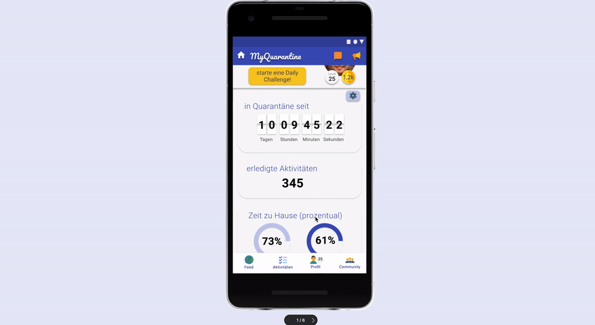

# MyQuarantine

Stay at Home Application. Prototype for #wirvsvirus Hackathon.

 

_orignal posted on [Devpost](https://devpost.com/software/myquarantine)_.

## Task (original)

Bürger:innen gehen immer noch weiter vor die Tür, da viele nicht ganz darauf verzichten möchten. Es gibt keine klaren Regelungen sondern liegt im Ermessensspielraum jedes einzelnen. Manche bleiben eine Woche in der Wohnung, andere gehen jeden Tag eine Stunde raus. Kann man über Social Media Apps wie Instagram und Facebook anreize setzen wie "Achievements" zu sammeln oder einzelne "Challenges" mit anderen zu machen zu Haus zu bleiben?

## What it does (original)

Der Klick-Prototyp zeigt, wie man innerhalb einer mobilen App häusliche Challenges allein oder mit Freunden absolviert. Dafür bekommt der Nutzer Punkte, steigt im Rang innerhalb der Community und kann seine Aktivitäten mit anderen teilen.

## Built with

## Links

* [Concept](./resources/mural-board.pdf)
* [Devpost Contribution](https://devpost.com/software/myquarantine)
* [Figma Prototype](https://www.figma.com/proto/3l8ANjzAwLF4MnoVPLCP48/MyQuarantine?node-id=16%3A60&viewport=-281%2C191%2C0.8558396697044373&scaling=scale-down)

